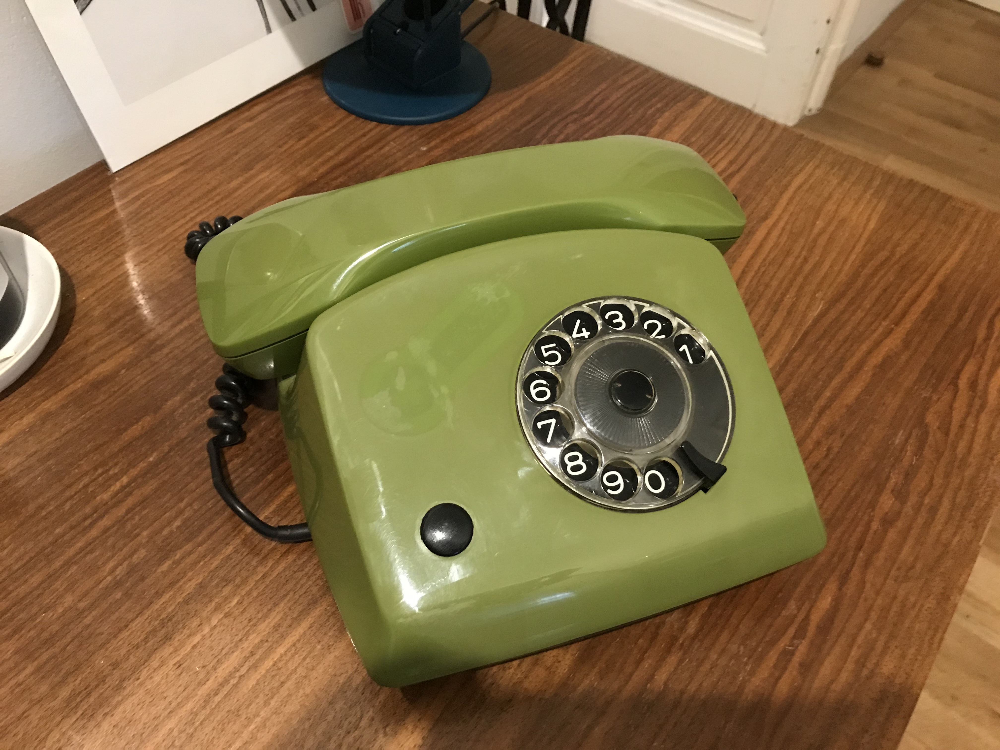
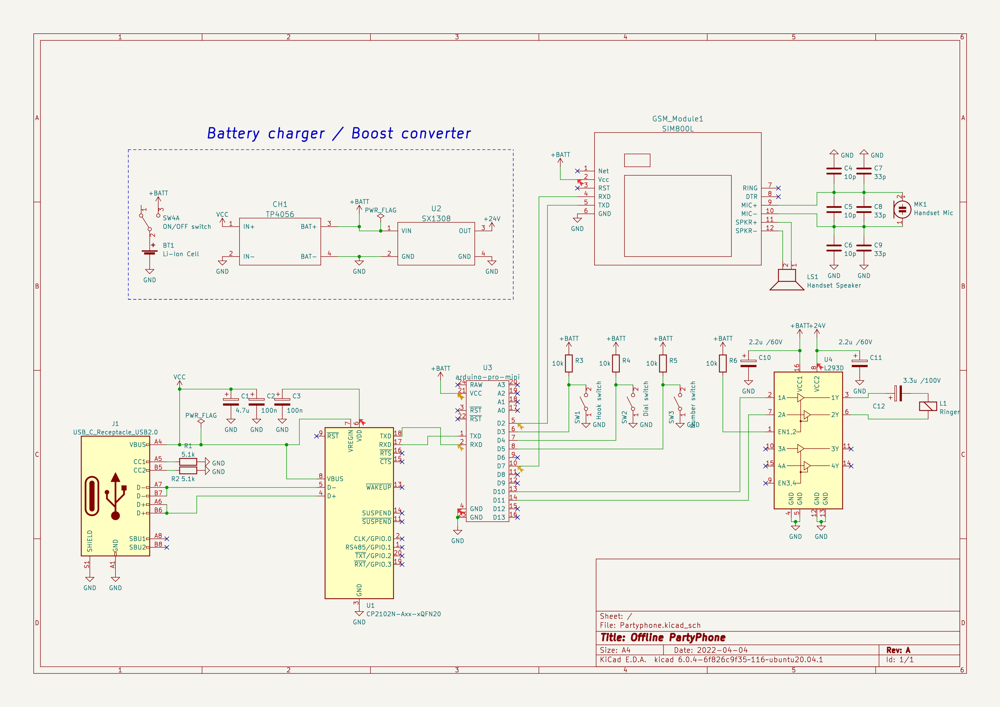
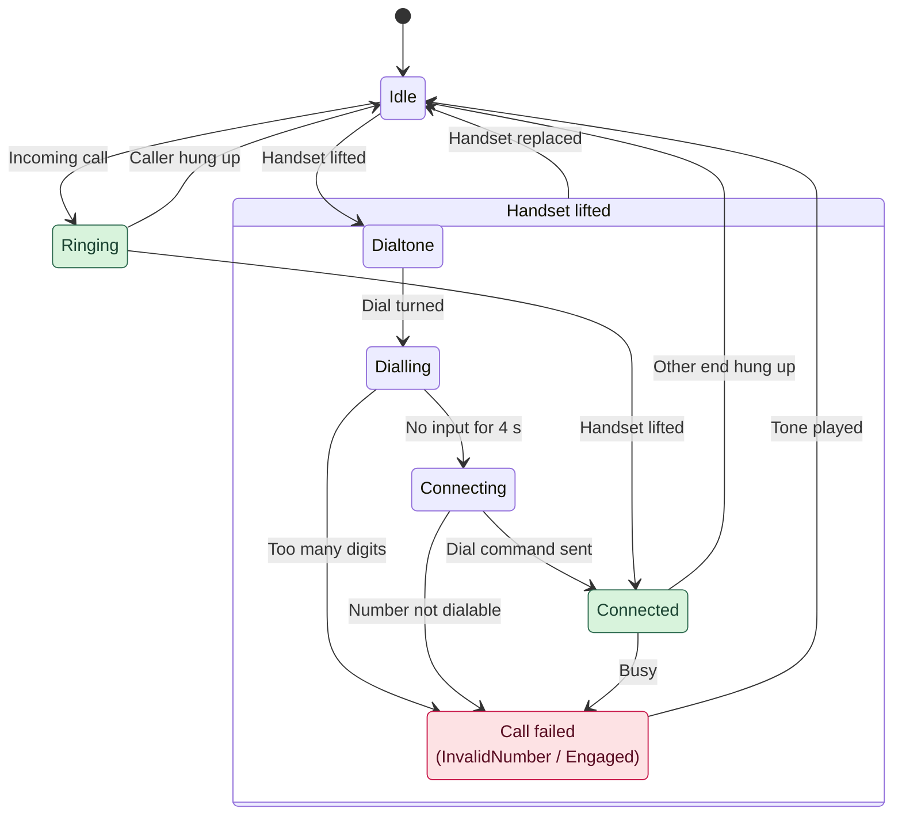

# Arduino Rotary phone for "offline" parties
An electronics/software project providing all the information about how to convert an old rotary phone into a modern cell phone.
## Foreword
Who doesn't know it, you are at a party and everyone is checking their phones or swiping through their Instagram. I find it very annoying when people stop communicating and instead dive into the digital world.

Somehow I have always felt jealous of people growing up before the digital age. Don't get me wrong, I really enjoy that tinkering and developing new things is very easy to do nowadays, but sometimes we seem to forget that our smartphone is **not** our best friend 😅

OK, enough of me rambling on. Let's briefly talk about how it all started and then get into the details.

## Project idea
When my girlfriend's grandma tidied up her attic, she found an old rotary phone they used back in the 80s (it seems like all phones here in Austria were olive green back in the days 🤨). As my girlfriend knows me very well, she saved it from the trash and gave it to me saying, "I know you love this old electronics stuff ..." (she really knows me well 😄).
In this moment the idea was born to convert the old rotary phone and bring its internals to the 21st century. What I always wanted to preserve were the looks and feels of an old rotary phone though. In the beginning this was just an idea but I really did not have a use-case for it.



The whole thing started to take shape when I was at a party where exactly the things described before happened and I thought to myself, 'How cool would it be if there were no smartphones at all and maybe just an old regular phone (a rotary phone) for emergencies or ordering a pizza'. Then immediately the old rotary phone of my girlfriend's grandparents popped into my mind 🙂

## Research
As I work in research, the first thing I always do is, well, research 😃 Someone must have had the same idea before or must have thought of at least something similar. It is always good to use things someone has had already wrapped their head around. And sure enough, I found something. Sparkfun had a product called [Bluetooth Portable Rotary Phone](https://www.sparkfun.com/products/retired/8929) in their portfolio a few years ago. Unfortunately, it got retired. Luckily, they still provide all the details about the circuit they used, as well as information about the rotary dial, the ringer circuit, you name it :) A huge thank you to Sparkfun for providing all this information for free.


## Hardware
With research out of the way, I started to think about the components I would need for such a project. As I wanted it to be quick and simple, I mostly used modules instead of developing my own PCB. So really any hobbyist can build it. The hardware components I used are as follows

* Rotary phone
* SIM800(LC) (2G Cellular phone module)
* L293D (H-bridge)
* Arduino with an ATmega168/328 running at 16 MHz (Pro mini, nano, etc.)
* Voltage boost module (XL6009, SX1308, etc.)
* Li-Po (Li-on) battery
* Li-Po charger module (TP4056)
* USB-Serial Converter (optional)

Those are the essential components. Of course you will need some more passive components like resistors and capacitors, but I assume anyone trying to build this project will have some laying around.

## Schematic
In the schematic you can see that I mostly used PCB modules to keep things simple. The only custom built section is the part where the microcontroller interfaces with the H-bridge. It has all been laid out on a perfboard with connectors for the individual modules.



### Pin assignment
The pin assignment used by the firmware is the following (see `src/main.cpp` and `include/sim800_defines.h`). If it differs from the pin labels in the schematic above, the firmware table is the one that counts.

| Function                        | Arduino pin | Notes                                              |
|---------------------------------|-------------|----------------------------------------------------|
| Hook switch                     | D3          | external pull-up, LOW = handset lifted             |
| Dial switch                     | D5          | external pull-up, LOW while the dial is turned     |
| Number (pulse) switch           | D6          | external pull-up, one pulse per number             |
| Ringer H-bridge inputs          | D10, D11    | driven with opposite polarity (L293D 1A/2A)        |
| SIM800 TX -> Arduino RX         | D2          | SoftwareSerial                                     |
| Arduino TX -> SIM800 RX         | D7          | SoftwareSerial                                     |
| Debug / programming serial      | D0, D1      | hardware serial, 57600 baud                        |

The switches need external pull-up resistors (10k), the firmware does not enable the internal ones.
## Firmware
The firmware has been developed in Arduino C++, again to keep things simple for everyone. The code is by no means optimized or anything and I know C runs a lot quicker on those tiny 8-bit microcontrollers. I personally find the Arduino environment very handy for quick prototyping and so on, as a lot of useful libraries exist.

The main firmware structure is oriented towards a finite-state-machine approach. I found a very nice [tutorial](https://www.youtube.com/watch?v=cZ2rHqBXO1s&t=368s) by a YouTube channel called [Playful Technology](https://www.youtube.com/c/PlayfulTechnology/featured). He uses an old rotary phone as a prop in an Escape Room game. Definitely worth a watch 🙂!

For an overview, here is the state diagram of the main program flow. Green states are active calls, red is a failed call attempt. Putting the handset back on the hook always returns the phone to `Idle`.


```mermaid
stateDiagram-v2
    direction TB

    [*] --> Idle

    state "Handset lifted" as OffHook {
        direction TB
        Dialtone --> Dialling: Dial turned
        Dialling --> Connecting: No input for 4 s
        Connecting --> Connected: Dial command sent
        state "Call failed<br/>(InvalidNumber / Engaged)" as Failed
        Dialling --> Failed: Too many digits
        Connecting --> Failed: Number not dialable
        Connected --> Failed: Busy
    }

    Idle --> Dialtone: Handset lifted
    Idle --> Ringing: Incoming call
    Ringing --> Idle: Caller hung up
    Ringing --> Connected: Handset lifted
    Connected --> Idle: Other end hung up
    Failed --> Idle: Tone played
    OffHook --> Idle: Handset replaced

    classDef call fill:#d8f3dc,stroke:#2d6a4f,color:#1b4332
    classDef problem fill:#fde2e4,stroke:#c9184a,color:#590d22
    class Ringing,Connected call
    class Failed problem
```

A few details that are not visible in the diagram:

* Every dialed digit restarts the 4 s timer (`START_CALL_DELAY_MS`) that starts the call, so you can take your time between digits.
* A failing AT command (`ERROR`, `+CME ERROR`) before the call is set up also returns the phone to `Idle`.
* `Call failed` covers the two firmware states `InvalidNumber` (number too long or not dialable) and `Engaged` (busy signal). Both play a tone or print a message and then fall back to `Idle`.

The main Arduino ```loop()``` consists of 4 simple update routines which check the switches, update timers, receive data from the SIM800 module and update the state machine.

```cpp
void loop()
{
  updateSwitches();
  updateTickers();
  updateSIM800();
  updateStateMachine();
}
```

Although the code is by no means optimized, the main loop runs with an update rate of > 10 kHz, which I think is more than enough. Thanks again to Playful Technology for leading me to a finite-state-machine approach. I also found a nice tutorial regarding FDMs on [arduinoplusplus](https://arduinoplusplus.wordpress.com/2019/07/06/finite-state-machine-programming-basics-part-1/) if you are interested.

### Building and flashing
The project uses [PlatformIO](https://platformio.org/). The required libraries ([Bounce2](https://github.com/thomasfredericks/Bounce2) and [arduino-timer](https://github.com/contrem/arduino-timer)) are downloaded automatically.

```bash
pio run                 # build
pio run -t upload       # build and flash
pio device monitor      # serial monitor (57600 baud)
```

The board, clock speed and upload settings are configured in `platformio.ini`. Adjust them if you use a different Arduino.

### Configuration
The most important settings are `#define`s at the top of `src/main.cpp`:

| Define                  | Meaning                                                              |
|-------------------------|----------------------------------------------------------------------|
| `LOCAL_COUNTRY_CODE`    | country code that replaces the leading `0` of a dialed number (`+43`) |
| `MAX_NUMBER_DIGITS`     | maximum number of digits that can be dialed                          |
| `START_CALL_DELAY_MS`   | pause after the last digit before the call is started                |
| `NUM_RINGS`, `RINGER_*` | ringing pattern of the bell                                          |

The pins and the AT commands of the SIM800 module are defined in `include/sim800_defines.h`.

### Usage
* **Outgoing call:** lift the handset, wait for the dial tone and dial the number. The call starts automatically a few seconds after the last digit.
  * `0xxxxxxxx` is a national number, the leading `0` is replaced by the country code
  * `00xxxxxxxx` is an international number, `00` is replaced by `+`
  * Three-digit emergency and service numbers starting with `1` (e.g. `112`, `122`, `133`, `144`) are dialed as they are
  * Any other number is rejected as invalid
* **Incoming call:** the bell rings, lift the handset to answer.
* **Hang up:** put the handset back on the hook.
* **Serial mode:** if the handset is lifted while the phone is powered on, the firmware acts as a serial bridge between the USB-serial converter and the SIM800 module, so you can send AT commands manually. Put the handset back to leave this mode.

## Acknowledgment
Many thanks also to 

- *Michael Contreras* for providing a very easy to use [arduino-timer](https://github.com/contrem/arduino-timer) library
- *Thomas Ouellet Fredericks* for providing a very cool debouncing library for switches [Bounce2](https://github.com/thomasfredericks/Bounce2)
- Guys at *Sparkfun* for providing a great deal of information about rotary phones and how a conversion can be done [Bluetooth Portable Rotary Phone](https://www.sparkfun.com/products/retired/9803)
- [*Playful Technology*](https://www.youtube.com/c/PlayfulTechnology/featured) for providing a very detailed tutorial on how to convert an old rotary phone

## License
MIT License

Copyright (c) 2022 Christoph Schmied

Permission is hereby granted, free of charge, to any person obtaining a copy
of this software and associated documentation files (the "Software"), to deal
in the Software without restriction, including without limitation the rights
to use, copy, modify, merge, publish, distribute, sublicense, and/or sell
copies of the Software, and to permit persons to whom the Software is
furnished to do so, subject to the following conditions:

The above copyright notice and this permission notice shall be included in all
copies or substantial portions of the Software.

THE SOFTWARE IS PROVIDED "AS IS", WITHOUT WARRANTY OF ANY KIND, EXPRESS OR
IMPLIED, INCLUDING BUT NOT LIMITED TO THE WARRANTIES OF MERCHANTABILITY,
FITNESS FOR A PARTICULAR PURPOSE AND NONINFRINGEMENT. IN NO EVENT SHALL THE
AUTHORS OR COPYRIGHT HOLDERS BE LIABLE FOR ANY CLAIM, DAMAGES OR OTHER
LIABILITY, WHETHER IN AN ACTION OF CONTRACT, TORT OR OTHERWISE, ARISING FROM,
OUT OF OR IN CONNECTION WITH THE SOFTWARE OR THE USE OR OTHER DEALINGS IN THE
SOFTWARE.


